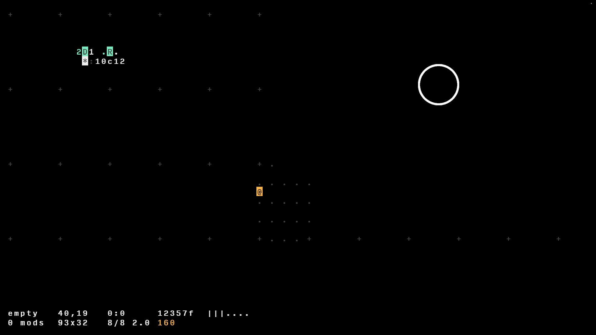
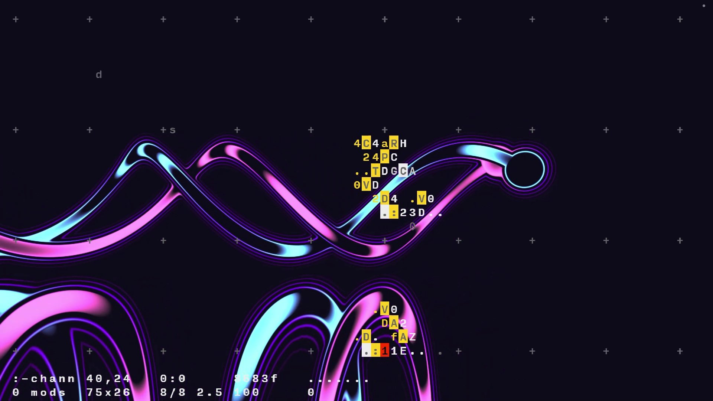

:::: titlepage
::: center
**Université Paris 8**\
**Master Création Numérique**\
parcours: *Arts et Technologies de l'Image Virtuelle*

------------------------------------------------------------------------

\
**Vers une interaction authentique entre *livecoders***\
*Forward The Revolution*

------------------------------------------------------------------------

\

------------------------------------------------------------------------

\
**Guillaume Cournet**\

------------------------------------------------------------------------

\

{width="60%"} \
**Mémoire de Master 2, 2023 - 2024**
:::
::::

::::: titlepage
::: flushleft
**Remerciements**
:::

::: flushleft
Ces remerciements font écho, d'une certaine manière, aux *greetings*[^1]
de la *demoscene*.

Je tiens tout d'abord à exprimer mes sincères remerciements à l'équipe
pédagogique d'ATI pour son soutien et sa disponibilité tout au long de
mon parcours à ATI. Un merci particulier à Farès Belhadj pour m'avoir
donné l'opportunité d'assister à son cours de programmation graphique en
tant qu'auditeur libre. Grâce à ses explications claires et détaillées,
j'ai pu approfondir ma compréhension des concepts mathématiques
sous-jacents à la création d'une scène 3D. Un merci particulier aussi à
Alain Lioret pour m'avoir subtilement montré la voie vers l'exploration
de l'art numérique. Un grand merci à Jeff Jego pour son soutien constant
tout au long de cette année de M2, ainsi que pour ses conseils avisés et
pertinents auxquels a posteriori j'aurais dû accorder plus d'attention.

Un énorme merci également à l'ensemble de ma promotion pour leur bonne
humeur et leur accueil chaleureux. Je tiens particulièrement à adresser
mes remerciements à Loïck pour son aide précieuse dans la gestion du
temps de rédaction de ce mémoire, ainsi qu'à Garvey pour son «
dématrixage » artistique.

Je ne saurais aussi passer sous silence l'apport essentiel d'Antoine
Boellinger, sans qui je n'aurais jamais découvert l'existence même des
*shaders*. Mes remerciements vont également à tous les membres du Cookie
Collective pour leur accueil bienveillant et leur partage de
connaissances. Je souhaite notamment exprimer ma reconnaissance envers
les animateurs d'atelier au Fuz : z0rg pour ses ateliers de *creative
coding*, Élie Gavoty pour ses sessions sur FoxDot, et Jules pour ses
enseignements sur SuperCollider. Je n'oublie pas non plus Pérégrine pour
son exigence mathématique et son dévouement dans la rédaction de la
précieuse documentation du wiki du Fuz.

Enfin, un grand merci à ma famille ainsi qu'à mon ami Nissim pour leur
soutien, leurs encouragements et leur implication dans la relecture de
ce mémoire, qui s'est avérée être indispensable.
:::
:::::

::::: titlepage
::: flushleft
**Préambule**
:::

::: flushleft
Le recours délibéré aux anglicismes mérite d'être souligné. Ces termes
anglais ont été sélectionnés pour leur précision et leur pertinence dans
le domaine du *live coding*. L'usage de ces expressions étrangères
s'inscrit dans le souhait de demeurer fidèle au langage communément
utilisé dans le milieu de la *demoscene*, où l'influence de l'anglais
est prépondérante. J'ai veillé à ce que ces mots soient mis en
*italique* dans le texte.

Par ailleurs, il me semblait important de préciser ma méthodologie quant
à l'utilisation de l'intelligence artificielle avec ChatGPT 3.5. Cette
dernière a été principalement sollicitée pour reformuler certains
paragraphes, tant du point de vue orthographique que du rythme des
phrases, et aussi dans le but d'éviter les répétitions. Cette
interaction avec l'IA peut être assimilée à un dialogue, similaire à une
partie de ping-pong, jusqu'à ce que le résultat satisfaisant soit
obtenu. En outre, j'ai également utilisé l'IA pour me suggérer des
titres de paragraphes lorsque j'étais en panne d'inspiration. Cependant,
j'ai également pris conscience des risques liés à la dépendance à l'IA.
À titre d'anecdote, dans le but d'économiser du temps, j'ai essayé de
résumer une vidéo d'une conférence portant sur l'histoire de la
*demoscene*, en fournissant à l'IA les sous-titres corrects de la vidéo.
Cependant, après avoir revu la vidéo ultérieurement, j'ai constaté que
l'IA ignorait des thèmes importants et mélangeait les dates ainsi que
les titres de *demos*. La leçon que j'en ai tirée est qu'il est
essentiel de toujours vérifier les informations produites par l'IA,
comme le souligne d'ailleurs l'interface de ChatGPT : *ChatGPT can make
mistakes. Consider checking important information*.
:::
:::::

 

 

# Introduction

Ma découverte du monde des *shaders* a été un véritable tournant dans
mon parcours. Préalablement à ma formation ATI, j'ai eu l'opportunité
d'acquérir une expérience précieuse en tant que développeur au sein du
département R&D de Xilam Animation.

C'est grâce à mon mentor de l'époque, Antoine Boellinger, responsable du
*pipeline* et ancien d'ATI, que j'ai pris conscience de l'existence même
des *shaders*. Cette révélation a été pour moi comme un choc électrique
: la possibilité de créer des images à partir des mathématiques m'a
semblé magique et m'a profondément intrigué. Dès lors, j'ai ressenti le
besoin d'approfondir mes connaissances dans ce domaine.

C'est au cours de la formation ATI que j'ai également eu l'opportunité
d'assister à une conférence du Cookie Collective à la Gaîté Lyrique,
expérience qui a été tout aussi marquante. Lors de cet événement, j'ai
été impressionné par la capacité des artistes à improviser des visuels
projetés sur grand écran, ainsi que par l'utilisation de langages
ésotériques pour produire de la musique. Ce spectacle a éveillé en moi
le désir de pouvoir un jour les imiter.

Depuis maintenant un peu plus d'un an, j'ai eu la chance d'assister à
des ateliers animés par z0rg au *hackerspace*[^2] le Fuz. Grâce à son
approche pédagogique qui va droit au but, j'ai pu acquérir une grande
partie de mes connaissances actuelles sur les *shaders*. Ces ateliers
m'ont également permis de découvrir une communauté particulièrement
généreuse, tant sur le plan humain que sur le plan du partage des
connaissances, et m'ont sensibilisé à l'esprit de l'*open source*[^3].

<figure id="intro07">


<figcaption>Performance son / visuels (photo Émilie Corne)</figcaption>
</figure>

À noter aussi qu'une certaine frustration a marqué mon parcours : le
sentiment de saturation lié à l'utilisation intensive de logiciels. Pour
répondre à cette frustration, j'ai décidé de m'éloigner autant que
possible de ces outils, dans une volonté affirmée de sortir de ma zone
de confort.

Cette expérience avec le Cookie Collective a été source d'inspiration
pour moi et a réaffirmé l'importance de la liberté créative et du
pouvoir du collectif. Elle a ravivé en moi l'espoir en un art novateur,
capable de dépasser les limites du « cinéma » tel que nous le
connaissons aujourd'hui, et d'explorer de nouvelles voies d'expression
artistique. L'esprit de communauté et l'organisation autonome de ce
collectif m'ont rappelé les mouvements de *free parties*[^4] des années
90 qui ont eu une influence profonde sur la culture et l'esthétique
numériques contemporaines.

En assistant aux performances, j'ai constaté que l'interaction entre le
*livecoder* de *shaders* et celui de musique était artificielle.
Habituellement, c'est le *livecoder* des *shaders* qui ajuste ses
variables en fonction du son qu'il entend, permettant ainsi au visuel de
suivre le rythme. Bien que cela puisse duper le public, cette
observation m'a incité à rechercher un moyen d'obtenir une interaction
authentique entre le son et le visuel. C'est précisément le sujet
principal abordé dans ce mémoire.

Dans la première partie, je revisiterai les origines de la *demoscene*,
en adoptant un angle plus historique que technique. Cette démarche
répond à un double objectif : enrichir ma culture personnelle et mieux
comprendre cet univers pour m'y intégrer pleinement.

La deuxième partie, précédée d'un bref rappel sur le *pipeline*
graphique, constitue une sorte de tutoriel visant à présenter les
techniques essentielles du *livecoding*. Pour des raisons de lisibilité,
j'ai opté pour une décomposition en deux sections. La première traitera
des techniques fondamentales pour écrire des *fragment shaders* en temps
réel, tandis que la seconde explorera des techniques plus avancées mais
optionnelles.

Conscient que certains de mes camarades de promotion sont passionnés par
le développement et la manipulation des *shaders* sans nécessairement
maîtriser la logique mathématique sous-jacente, j'ai cherché à rendre
ces concepts accessibles et didactiques. J'espère ainsi susciter leur
intérêt pour la programmation des *shaders*.

Enfin, la dernière partie de ce mémoire sera consacrée à mes
expérimentations, mettant en lumière certains langages spécifiques au
*livecoding* musical, notamment FoxDot et Orca. Ces solutions se sont
avérées parfaitement adaptées à mes besoins, car FoxDot offre une
expérience proche de la notation musicale traditionnelle, en rapport
avec mon expérience en gravure musicale[^5], tandis qu'Orca m'a séduit
par sa syntaxe originale et sa créativité graphique.

Après avoir exploré en détail la structure d'un fichier MIDI
(consultable en annexe), la fin de cette dernière partie sera consacrée
à l'introduction d'une solution visant à récupérer les informations MIDI
en vue d'animer un *shader*. Cette approche évite l'utilisation de
logiciels tiers pour se rapprocher d'un *pipeline* de développement
purement basé sur le code.

Il me semblait aussi important de souligner que mon intention première
était d'inclure des chapitres dédiés à l'*algorave* et à la musique
algorithmique. Cependant, en raison d'une contrainte de temps et d'une
surestimation de mes capacités, j'ai été contraint d'abandonner ces
sujets.

<figure id="intro02">


<figcaption>Performance musique/<em>shaders</em> au bar la Chair de
Poule (photo Léon Denise)</figcaption>
</figure>

# Conclusion

Dans ce mémoire, j'ai exploré les origines de l'art de la *demoscene* et
examiné les techniques essentielles pour une performance de *livecoding*
de *shaders* réussie. Par la suite, j'ai centré mon analyse sur
l'interaction authentique entre la musique et le visuel, dans l'espoir
de contribuer modestement à l'évolution de la *demoscene*.

##### Mes expérimentations {#mes-expérimentations .unnumbered}

Au cours de mes explorations, j'ai réalisé quelques expérimentations
disponibles sur Vimeo. Bien qu'en l'état peu ambitieuses, elles servent
de preuve de concept[^6] : si j'ai réussi à modifier le rayon d'un
cercle uniquement avec la vélocité de la note jouée, cela démontre la
possibilité d'agir sur n'importe quelle variable définie dans le code
GLSL (voir [\[experim00\]](#experim00){reference-type="ref"
reference="experim00"} et [2.1](#experim01){reference-type="ref"
reference="experim01"} [sur ma page
Vimeo](https://vimeo.com/user167850166)).

<figure id="experim01">


<figcaption><em>Live</em> avec une note aléatoire</figcaption>
</figure>

Maintenant que j'ai confirmé que les mécanismes interactifs nécessaires
sont déjà établis et fonctionnels, je suis prêt à explorer ce nouveau
*pipeline* qui répond parfaitement à mes attentes. À chaque itération,
j'améliore le flux de travail en factorisant le code, en ajoutant des
fonctionnalités, en peaufinant l'animation, etc. (voir
[\[experim03\]](#experim03){reference-type="ref" reference="experim03"}
et [2.2](#experim02){reference-type="ref" reference="experim02"})

<figure id="experim02">


<figcaption><em>Hack</em> pour la transparence d’Orca</figcaption>
</figure>

##### Journée d'étude sur le *live coding* {#journée-détude-sur-le-live-coding .unnumbered}

Un récent événement qui a profondément marqué mon expérience était la
« journée d'étude sur le live coding », orchestrée par Raphaël Forment,
Rémi Georges et Agathe Herrou à la Maison des Sciences de l'Homme à La
Plaine St-Denis (voir [2.3](#jlc00){reference-type="ref"
reference="jlc00"}). Cette journée comprenait une série de conférences
suivies de performances sonores et visuelles. C'est lors de cet
événement que j'ai vraiment pris conscience que le *livecoding* était un
véritable domaine de recherche et de création, réunissant des artistes,
des chercheurs et des passionnés aux parcours différents autour d'un
geste commun : celui de manipuler du code source « à la volée » dans un
but d'expression artistique et de création. Une présentation qui a
captivé mon attention est celle de Vincent Rioux : *Redécouvrir le
live-coding en LISP, i-a-d-d-la-joie ! -- Utiliser Lisp et Supercollider
avec une intelligence simple*. Son travail met en avant la création d'un
lien entre la musique et les arts visuels, notamment entre les
Beaux-Arts de Paris et l'IRCAM (Institut de Recherche et de Coordination
Acoustique/Musique). Je prévois d'approfondir ses travaux, car les
sujets qu'il aborde semblent étroitement liés aux miens.

{#jlc00 width="6cm"}

##### Vers un mélange des arts et la démocratisation de la *demoscene* {#vers-un-mélange-des-arts-et-la-démocratisation-de-la-demoscene .unnumbered}

Grâce aux rencontres que j'ai pu faire cette année lors des événements
organisés par le Cookie Collective, j'ai eu l'opportunité d'explorer de
nouvelles perspectives. En particulier, ma brève rencontre avec
Alexandre et Sharlaine, les organisateurs du Playground (voir
[2.4](#peanut){reference-type="ref" reference="peanut"}), un événement
dédié au *creative coding* à Bordeaux, m'a profondément inspiré (leur
site est consultable [ici](https://plgrnd.cc/)). Leur approche originale
renforce mon désir de rendre la *demoscene* plus accessible en mettant
l'accent sur la diffusion d'une éducation technique capable de
sensibiliser et d'impliquer un public plus large. De plus, leur
collaboration en tant que duo, « La Peanut », qui combine le
*livecoding*, le théâtre et la poésie, reflète également mes aspirations
à faire progresser mes recherches et mes créations numériques vers un
« mélange des arts ». Ces arts pourraient inclure des récitations de
texte (narratives ou non), l'intégration d'instruments acoustiques ou
encore la manipulation de vidéos en direct.

<figure id="peanut">


<figcaption>Programme du Playground organisé par Alexandre</figcaption>
</figure>

##### Vers une communication réseau {#vers-une-communication-réseau .unnumbered}

Jusqu'à présent, mes expérimentations techniques ont été réalisées sur
une seule machine. Cependant, comme l'indique le titre de mon mémoire, «
*Vers une interaction authentique entre livecoders* », cela illustre
également mon désir initial d'impliquer plusieurs *livecoders* au cours
d'une même performance. En pratique, un *livecoder* serait responsable
de la création musicale sur Orca et enverrait les informations MIDI via
le réseau à une autre machine contrôlée par un *livecoder* de *shaders*.
Cet objectif constituait le cœur de mon intensif en M2. Malheureusement,
notre groupe a dû faire face à de nombreuses complications, à la fois
matérielles et logistiques, qui nous ont empêché d'atteindre cet
objectif dans les délais impartis. Cependant, avec le recul, j'ai
découvert l'existence de solutions déjà disponibles qui auraient pu nous
faciliter la réalisation. Parmi les solutions envisagées, je compte
explorer Troop et Flok, des logiciels permettant à plusieurs
utilisateurs de pratiquer le *livecoding* musical sur un serveur commun.
Dans mes futures recherches, je m'efforcerai de trouver une solution
équivalente mais orientée vers l'intégration collaborative du visuel et
du sonore.

{#stribe00 width="6cm"}

# Liste opérateurs Orca {#appendix:orcaops}

## En anglais {#en-anglais .unnumbered}

-   **A** : add(a b) -- Outputs sum of inputs.

-   **B** : subtract(a b) -- Outputs difference of inputs.

-   **C** : clock(rate mod) -- Outputs modulo of frame.

-   **D** : delay(rate mod) -- Bangs on modulo of frame.

-   **E** : east -- Moves eastward, or bangs.

-   **F** : if(a b) -- Bangs if inputs are equal.

-   **G** : generator(x y len) -- Writes operands with offset.

-   **H** : halt -- Halts southward operand.

-   **I** : increment(step mod) -- Increments southward operand.

-   **J** : jumper(val) -- Outputs northward operand.

-   **K** : konkat(len) -- Reads multiple variables.

-   **L** : lesser(a b) -- Outputs smallest of inputs.

-   **M** : multiply(a b) -- Outputs product of inputs.

-   **N** : north -- Moves Northward, or bangs.

-   **O** : read(x y read) -- Reads operand with offset.

-   **P** : push(len key val) -- Writes eastward operand.

-   **Q** : query(x y len) -- Reads operands with offset.

-   **R** : random(min max) -- Outputs random value.

-   **S** : south -- Moves southward, or bangs.

-   **T** : track(key len val) -- Reads eastward operand.

-   **U** : uclid(step max) -- Bangs on Euclidean rhythm.

-   **V** : variable(write read) -- Reads and writes variable.

-   **W** : west -- Moves westward, or bangs.

-   **X** : write(x y val) -- Writes operand with offset.

-   **Y** : jymper(val) -- Outputs westward operand.

-   **Z** : lerp(rate target) -- Transitions operand to input.

-   **\*** : bang -- Bangs neighboring operands.

-   **\#** : comment -- Halts a line.

-   **:** : midi(channel octave note velocity length) -- Sends a MIDI
    note.

-   **%** : mono(channel octave note velocity length) -- Sends
    monophonic MIDI note.

-   **!** : cc(channel knob value) -- Sends MIDI control change.

-   **?** : pb(channel value) -- Sends MIDI pitch bend.

-   **;** : udp -- Sends UDP message.

-   **=** : osc(path) -- Sends OSC message.

-   **\$** : self -- Sends ORCA commands.

## En français {#en-français .unnumbered}

-   **A** : add(a b) -- Renvoie la somme des entrées.

-   **B** : subtract(a b) -- Renvoie la différence des entrées.

-   **C** : clock(rate mod) -- Renvoie le modulo de la *frame*.

-   **D** : delay(rate mod) -- Déclenche un *bang* sur le modulo de la
    *frame*.

-   **E** : east -- Se déplace vers l'est, ou déclenche un *bang*.

-   **F** : if(a b) -- Déclenche si les entrées sont égales.

-   **G** : generator(x y len) -- Écrit les opérandes avec un *offset*.

-   **H** : halt -- Arrête l'opérateur Sud.

-   **I** : increment(step mod) -- Incrémente l'opérateur Sud.

-   **J** : jumper(val) -- Renvoie l'opérande vers le nord.

-   **K** : konkat(len) -- Lit plusieurs variables.

-   **L** : lesser(a b) -- Renvoie la plus petite des entrées.

-   **M** : multiply(a b) -- Renvoie le produit des entrées.

-   **N** : north -- Se déplace vers le nord, ou déclenche un *bang*.

-   **O** : read(x y read) -- Lit l'opérande avec un décalage.

-   **P** : push(len key val) -- Écrit l'opérande vers l'est.

-   **Q** : query(x y len) -- Lit les opérandes avec un décalage.

-   **R** : random(min max) -- Renvoie une valeur aléatoire.

-   **S** : south -- Se déplace vers le sud, ou déclenche un *bang*.

-   **T** : track(key len val) -- Lit l'opérande vers l'est.

-   **U** : uclid(step max) -- Déclenche sur un rythme euclidien.

-   **V** : variable(écrire lire) -- Lit et écrit une variable.

-   **W** : west -- Se déplace vers l'ouest, ou déclenche un *bang*.

-   **X** : write(x y val) -- Écrit l'opérande avec un décalage.

-   **Y** : jymper(val) -- Renvoie l'opérande vers l'ouest.

-   **Z** : lerp(rate target) -- Transitions de l'opérande vers
    l'entrée.

-   **\*** : bang -- Déclenche les opérandes voisines.

-   **\#** : comment -- Arrête une ligne.

-   **:** : midi(canal octave note vélocité durée) -- Envoie une note
    MIDI.

-   **%** : mono(canal octave note vélocité durée) -- Envoie une note
    MIDI monophonique.

-   **!** : cc(canal bouton valeur) -- Envoie un message de changement
    de contrôle MIDI.

-   **?** : pb(canal valeur) -- Envoie un message de pitch bend MIDI.

-   **;** : udp -- Envoie un message UDP.

-   **=** : osc(chemin) -- Envoie un message OSC.

-   **\$** : self -- Envoie des commandes ORCA.

# Code C/C++ pour composer de la musique {#appendix:codemidi}

``` {.c++ language="C++" caption="CPP MIDI" captionpos="b"}
#include <vector>   // For std::vector<>
#include <cstring>  // For std::strlen()
#include <cstdio>   // For std::fopen(), std::fwrite(), std::fclose()

typedef unsigned char byte;

/* First define a custom wrapper over std::vector<byte>
 * so we can quickly push_back multiple bytes with a single call.
 */
class MIDIvec: public std::vector<byte>
{
public:
    // Methods for appending raw data into the vector:
    template<typename... Args>
    void AddBytes(byte data, Args...args)
    {
        push_back(data);
        AddBytes(args...);
    }
    template<typename... Args>
    void AddBytes(const char* s, Args...args)
    {
        insert(end(), s, s + std::strlen(s));
        AddBytes(args...);
    }
    void AddBytes() { }
};

/* Define a class which encodes MIDI events into a track */
class MIDItrack: public MIDIvec
{
protected:
    unsigned delay, running_status;
public:
    MIDItrack()
        : MIDIvec(), delay(0), running_status(0)
    {
    }
    
    // Methods for indicating how much time elapses:
    void AddDelay(unsigned amount) { delay += amount; }
    
    void AddVarLen(unsigned t)
    {
        if(t >> 21) AddBytes(0x80 | ((t >> 21) & 0x7F));
        if(t >> 14) AddBytes(0x80 | ((t >> 14) & 0x7F));
        if(t >>  7) AddBytes(0x80 | ((t >>  7) & 0x7F));
        AddBytes(((t >> 0) & 0x7F));
    }
    
    void Flush()
    {
        AddVarLen(delay);
        delay = 0;
    }
    
    // Methods for appending events into the track:
    template<typename... Args>
    void AddEvent(byte data, Args...args)
    {
        /* MIDI tracks have the following structure:
         *
         * { timestamp [metaevent ... ] event } ...
         *
         * Each event is prefixed with a timestamp,
         * which is encoded in a variable-length format.
         * The timestamp describes the amount of time that
         * must be elapsed before this event can be handled.
         *
         * After the timestamp, comes the event data.
         * The first byte of the event always has the high bit on,
         * and the remaining bytes always have the high bit off.
         *
         * The first byte can however be omitted; in that case,
         * it is assumed that the first byte is the same as in
         * the previous command. This is called "running status".
         * The event may furthermore beprefixed
         * with a number of meta events.
         */
       Flush();
       if(data != running_status) AddBytes(running_status = data);
       AddBytes(args...);
    }
    void AddEvent() { }
    
    template<typename... Args>
    void AddMetaEvent(byte metatype, byte nbytes, Args...args)
    {
        Flush();
        AddBytes(0xFF, metatype, nbytes, args...);
    }
    
    // Key-related parameters: channel number, note number, pressure
    void KeyOn(int ch, int n, int p)    { if(n>=0)AddEvent(0x90|ch, n, p); }
    void KeyOff(int ch, int n, int p)   { if(n>=0)AddEvent(0x80|ch, n, p); }
    void KeyTouch(int ch, int n, int p) { if(n>=0)AddEvent(0xA0|ch, n, p); }
    // Events with other types of parameters:
    void Control(int ch, int c, int v) { AddEvent(0xB0|ch, c, v); }
    void Patch(int ch, int patchno)    { AddEvent(0xC0|ch, patchno); }
    void Wheel(int ch, unsigned value)
        { AddEvent(0xE0|ch, value&0x7F, (value>>7)&0x7F); }
    
    // Methods for appending metadata into the track:
    void AddText(int texttype, const char* text)
    {
        AddMetaEvent(texttype, std::strlen(text), text);
    }
};

/* Define a class that encapsulates all methods needed to craft a MIDI file. */
class MIDIfile: public MIDIvec
{
protected:
    std::vector<MIDItrack> tracks;
    unsigned deltaticks, tempo;
public:
    MIDIfile()
        : MIDIvec(), tracks(), deltaticks(1000), tempo(1000000)
    {
    }
    
    void AddLoopStart()  { (*this)[0].AddText(6, "loopStart"); }
    void AddLoopEnd()    { (*this)[0].AddText(6, "loopEnd"); }
    
    MIDItrack& operator[] (unsigned trackno)
    {
        if(trackno >= tracks.size())
        {
            tracks.reserve(16);
            tracks.resize(trackno+1);
        }
        
        MIDItrack& result = tracks[trackno];
        if(result.empty())
        {
            // Meta 0x58 (misc settings):
                //      time signature: 4/2
                //      ticks/metro:    24
                //      32nd per 1/4:   8
            result.AddMetaEvent(0x58,4,  4,2, 24,8);
            // Meta 0x51 (tempo):
            result.AddMetaEvent(0x51,3,  tempo>>16, tempo>>8, tempo);
        }
        return result;
    }
    
    void Finish()
    {
        clear();
        AddBytes(
            // MIDI signature (MThd and number 6)
            "MThd", 0,0,0,6,
            // Format number (1: multiple tracks, synchronous)
            0,1,
            tracks.size() >> 8, tracks.size(),
            deltaticks    >> 8, deltaticks);
        for(unsigned a=0; a<tracks.size(); ++a)
        {
            // Add meta 0x2F to the track, indicating the track end:
            tracks[a].AddMetaEvent(0x2F, 0);
            // Add the track into the MIDI file:
            AddBytes("MTrk",
                tracks[a].size() >> 24,
                tracks[a].size() >> 16,
                tracks[a].size() >>  8,
                tracks[a].size() >>  0);
            insert(end(), tracks[a].begin(), tracks[a].end());
        }
    }
};

int main()
{
    // Now that we have a class that can create MIDI files, let's create
    // music.
    
    // Begin with some chords.
    static const int chords[][3] =
    {
        { 12,4,7 }, // +C  E  G  = 0
        { 12,9,5 }, // +C  A  F  = 1
        { 12,8,3 }, // +C  G# D# = 2
        { 12,7,3 }, // +C  G  D# = 3
        { 12,5,8 }, // +C  F  G# = 4
        { 12,3,8 }, // +C  D# G# = 5
        { 11,2,7 }, //  B  D  G  = 6
        { 10,2,7 }, // A#  D  G  = 7
        { 14,7,5 }, // +D  G  F  = 8
        { 14,7,11 },// +D  G  B  = 9
        { 14,19,11 }// +D +G  B  = 10
    };
    const char x = 99; // Arbitrary value we use here to indicate "no note"
    static const char chordline[64] =
    {
        0,x,0,0,x,0,x, 1,x,1,x,1,1,x,1,x,  2,x,2,2,x,2,x, 3,x,3,x,3,3,x,3,x,
        4,x,4,4,x,4,x, 5,x,5,x,5,5,x,5,x,  6,7,6,x,8,x,9,x,10,x,x,x,x,x,x,x
    };
    static const char chordline2[64] =
    {
        0,x,x,x,x,x,x, 1,x,x,x,x,x,x,x,x,  2,x,x,x,x,x,x, 3,x,x,x,x,x,x,x,x,
        4,x,x,x,x,x,x, 5,x,x,x,x,x,x,x,x,  6,x,x,x,x,x,x,x, 6,x,x,x,x,x,x,x
    };
    static const char bassline[64] =
    {
        0,x,x,x,x,x,x, 5,x,x,x,x,x,x,x,x,  8,x,x,0,x,3,x, 7,x,x,x,x,x,x,x,x,
        5,x,x,x,x,x,x, 3,x,x,x,x,x,x,x,x,  2,x,x,x,x,x,x,-5,x,x,x,x,x,x,x,x
    };
    static const char fluteline[64] =
    {
        12,x,12,12, x,9, x, 17,x,16,x,14,x,12,x,x,
         8,x, x,15,14,x,12,  x,7, x,x, x,x, x,x,x,
         8,x, x, 8,12,x, 8,  x,7, x,8, x,3, x,x,x,
         5,x, 7, x, 2,x,-5,  x,5, x,x, x,x, x,x,x
    };
    
    MIDIfile file;
    file.AddLoopStart();
    
    /* Choose instruments ("patches") for each channel: */
    static const char patches[16] =
    {
        0,0,0, 52,52,52, 48,48,48, 0,0,0,0,0, 35,74
        /* 0=piano, 52=choir aahs, 48=strings, 35=fretless bass, 74=pan flute */
    };
    for(unsigned c=0; c<16; ++c)
        if(c != 10) // Patch any other channel but not the percussion channel.
            file[0].Patch(c, patches[c]);
    
    int keys_on[16] = {-1,-1,-1,-1, -1,-1,-1,-1, -1,-1,-1,-1, -1,-1,-1,-1 };
    for(unsigned loops=0; loops<2; ++loops)
    {
        for(unsigned row=0; row<128; ++row)
        {
            for(unsigned c=0; c<16; ++c)
            {
                int note = x, add = 0, vol = 127;
                if(c < 3) // Piano chord
                  { int chord = chordline[row%64];
                    if(chord != x) note = chords[chord][c%3], add=12*5, vol=0x4B; }
                else if(c >= 3 && c < 5) // Aux chord (choir)
                  { int chord = chordline2[row%64];
                    if(chord != x) note = chords[chord][c%3], add=12*4, vol=0x50; }
                else if(c >= 6 && c < 8) // Aux chord (strings)
                  { int chord = chordline2[row%64];
                    if(chord != x) note = chords[chord][c%3], add=12*5, vol=0x45; }
                else if(c == 14) // Bass
                    note = bassline[row%64], add=12*3, vol=0x6F;
                else if(c == 15 && row >= 64) // Flute
                    note = fluteline[row%64], add=12*5, vol=0x6F;
                if(note == x && (c<15 || row%31)) continue;
                file[0].KeyOff(c, keys_on[c], 0x20);
                keys_on[c] = -1;
                if(note == x) continue;
                file[0].KeyOn(c, keys_on[c] = note+add, vol);
            }
            file[0].AddDelay(160);
        }
        if(loops == 0) file.AddLoopEnd();
    }
    
    file.Finish();
    
    FILE* fp = std::fopen("test.mid", "wb");
    std::fwrite(&file.at(0), 1, file.size(), fp);
    std::fclose(fp);
    
    return 0;
}
```

# Signaux MIDI {#appendix:midi}

## *Note On* et *Note Off* {#note-on-et-note-off .unnumbered}

Les messages *Note On* et *Note Off* sont fondamentaux en MIDI pour la
gestion des notes jouées. Le message « Note On » informe sur la touche
pressée, sa vélocité et le canal MIDI concerné. Il est composé d'un
octet de statut commençant par $1001$, suivi de deux octets de données :
le premier pour la note jouée et le second pour la vélocité. Le message
*Note Off*, quant à lui, indique la libération d'une touche avec les
mêmes détails que *Note On*, mais avec un statut différent commençant
par $1000$ (pour rappel, à chaque fois le $1$ est là pour préciser qu'il
s'agit d'un octet de statut). Par exemple, voici les représentations
d'un message *Note On* qui jouerait un Do avec une vélocité maximale et
celui d'un message *Note Off* qui lui ferait miroir:

``` {.GLSL language="GLSL" caption="\\textit{Note On}" captionpos="b" frame="single"}
Note On : 0x9n (1001 nnnn)
Exemple : 0x90 0x3C 0x7F
0x90 (1001 0000) : Note On sur le canal MIDI 1
0x3C (0011 1100) : Note numero 60 (Do central)
0x7F (0111 1111) : Velocite maximale (127)
```

``` {.GLSL language="GLSL" caption="\\textit{Note Off}" captionpos="b" frame="single"}
Note Off : 0x8n (1000 nnnn)
Exemple : 0x80 0x3C 0x40
0x80 (1000 0000) : Note Off sur le canal MIDI 1
0x3C (0011 1100) : Note numero 60 (Do central)
0x40 (0100 0000) : Velocite 64 (valeur typique pour un Note Off)
```

L'information de vélocité est intégrée dans les messages « Note On » et
« Note Off », reflétant la vitesse à laquelle une touche est relâchée.

## *Aftertouch Polyphonic* et *Aftertouch Channel* {#aftertouch-polyphonic-et-aftertouch-channel .unnumbered}

Les messages *Aftertouch*, qu'ils soient *Polyphonic* ou *Channel*,
renvoient des informations sur la pression appliquée sur une touche
après l'émission initiale. Bien que cette caractéristique ne soit pas
présente dans les pianos mécaniques, elle trouve son utilité dans
d'autres instruments comme les instruments à vent ou à cordes.

Le *Polyphonic Aftertouch* envoie la pression individuelle pour chaque
touche pressée, nécessitant donc trois octets par note.

``` {.GLSL language="GLSL" caption="\\textit{Aftertouch} Polyphonique" captionpos="b" frame="single"}
Aftertouch Polyphonique : 0xAn (1010 nnnn)
Exemple : 0xA0 0x3C 0x40
0xA0 (1010 0000) : Aftertouch Polyphonique sur le canal MIDI 1
0x3C (0011 1100) : Note numero 60 (Do central)
0x40 (0100 0000) : Pression de la touche
```

Par contre le *Channel Aftertouch* envoie uniquement la pression de la
touche avec la pression la plus élevée, nécessitant seulement deux
octets.

``` {.GLSL language="GLSL" caption="\\textit{Aftertouch} de canal" captionpos="b" frame="single"}
Aftertouch de canal (Channel Aftertouch) : 0xDn (1101 nnnn)
Exemple : 0xD0 0x40
0xD0 (1101 0000) : Aftertouch de canal sur le canal MIDI 1
0x40 (0100 0000) : Pression de la touche
```

## Changement de contrôle (*Control Change*) {#changement-de-contrôle-control-change .unnumbered}

Le message *Control Change* transmet des informations sur les
contrôleurs tels que les boutons, pédales et curseurs. Ce message est
constitué d'un octet de statut avec un préfixe $1011$, suivi du canal,
du numéro du contrôleur, et de la valeur (de $0$ à $127$).

``` {.GLSL language="GLSL" caption="Changement de contrôle" captionpos="b" frame="single"}
Changement de controle (Control Change) : 0xB0 (1011 nnnn)
Exemple : 0xB0 0x07 0x64
0xB0 (1011 0000) : Controle de changement sur le canal MIDI 1
0x07 (0000 0111) : Numero de controleur (ici, le controle de volume)
0x64 (0110 0100) : Valeur du controle (100 en decimal, indiquant le volume a 100)
```

## Changement de Programme (*Program Change*) {#changement-de-programme-program-change .unnumbered}

Bien que considéré comme une relique des débuts des synthétiseurs
logiciels, le message *Program Change* était utilisé pour signaler les
changements de patch. À l'origine, avec $127$ voix disponibles dans tous
les synthétiseurs MIDI, ce système était particulièrement adapté aux
jeux vidéo, permettant une expérience musicale cohérente sur différents
matériels. Ces $127$ voix incluent également des effets sonores comme le
chant des oiseaux ou le bruit de téléphone. Les messages *Program
Change* se composent de deux octets : un octet de statut commençant par
$1100$, indiquant le canal, suivi d'un octet de données désignant le
nouvel instrument.

``` {.GLSL language="GLSL" caption="Changement de programme" captionpos="b" frame="single"}
Changement de programme (Program Change) : 0xCn (1100 nnnn)
Exemple : 0xC0 0x04
0xC0 (1100 0000) : Changement de programme sur le canal MIDI 1
0x04 (0000 0100) : Programme numero 5
```

## *Pitch Bend* {#pitch-bend .unnumbered}

Le *Pitch Bend* se distingue des autres contrôleurs continus par sa
résolution plus élevée dans le protocole MIDI. Au lieu d'utiliser une
plage de valeurs de $0$ à $127$, le *Pitch Bend* utilise deux octets
pour fournir une résolution de 14 bits, offrant $16384$ ($2^14$) valeurs
possibles. Cette précision est essentielle pour un contrôle microtonal
détaillé, ce qui est particulièrement utile pour des données à haute
résolution dans le protocole MIDI.

``` {.GLSL language="GLSL" caption="Pitch Bend" captionpos="b" frame="single"}
Pitch Bend : 0xEn (1110 nnnn)
Exemple : 0xE0 0x00 0x40
0xE0 (1110 0000) : Pitch Bend sur le canal MIDI 1
0x00 0x40 (0000 0000 0100 0000) : Valeur du pitch bend (vers le haut)
```

[^1]: Dans la culture de la *demoscene*, les *greetings* sont des
    salutations, souvent inclues dans les *demos*, adressées à d'autres
    groupes de la *demoscene*, à des personnes spécifiques ou à la
    communauté dans son ensemble.

[^2]: Un *hackerspace* est un espace physique où des passionnés de
    technologie, de programmation informatique et de création
    collaborative se réunissent pour travailler sur des projets,
    échanger des connaissances et partager des ressources.

[^3]: L'esprit *open source* se réfère à une approche collaborative et
    transparente du développement de logiciels et de technologies, basée
    sur le partage libre et ouvert du code source. Les projets *open
    source* permettent à quiconque d'accéder, d'étudier, de modifier et
    de redistribuer le code source d'un logiciel, favorisant ainsi la
    collaboration et l'innovation collective.

[^4]: Les *free parties* sont des événements musicaux et culturels
    autonomes, souvent organisés de manière clandestine et sans
    autorisation officielle, caractérisés par une programmation musicale
    centrée sur la musique électronique *underground*. Ces événements se
    déroulent généralement dans des lieux inhabituels ou alternatifs,
    tels que des entrepôts abandonnés, des champs, des forêts ou des
    *squats*.

[^5]: La gravure musicale est le processus de notation ou de
    transcription de la musique dans un format numérique à l'aide de
    logiciels spécialisés. Cette pratique consiste à représenter les
    éléments musicaux tels que les notes, les rythmes, les indications
    de tempo, les dynamiques et d'autres instructions d'interprétation
    de manière visuelle et compréhensible pour les musiciens. Les
    principales solutions logicielles de gravure musicale comprennent
    des programmes tels que Finale, MuseScore et LilyPond (ma solution
    privilégiée).

[^6]: Un *proof of concept* (POC), traduit littéralement en français par
    « preuve de concept », est une démonstration ou un prototype qui
    vise à prouver la faisabilité ou la viabilité d'une idée, d'un
    concept ou d'une méthode.
